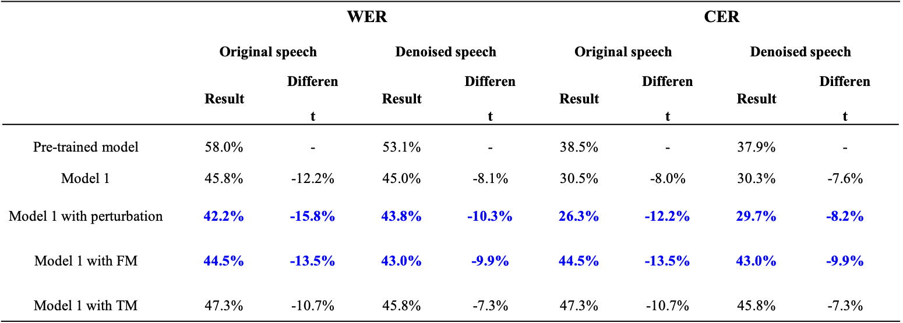

# Parkinson-Patient-Speech-Dataset 

This repository contains two speech dataset from patients diagnosed with Parkinson's Disease: original-speech-dataset and denoised-speech-dataset.
The original-speech-dataset is obtained from tem patients. 
The denoised speech dataset is obtained after denoising from original-speech-dataset. 

<!-- TABLE OF CONTENTS -->
## Table of Contents 

* [Introduction of the speech dataset](#Introduction_of_the_speech_dataset)  
* [Model](#Model)  
* [Data Augmentation](#Data_Augmentation)  
    * [Speed perturbation](#Speed_perturbation)  
    * [Spectrogram masking](#Spectrogram_masking)  
* [Performance](#Performance)
* [Author](#Author)
* [License](#License)


## Introduction of the speech dataset 

The dataset is obtained from six males and four females. Each folder contains wav files and txt transcripts.
   
   - The folder named *DL* contains audio clips extracted from the video [Dad Living With Parkinson's](https://www.youtube.com/watch?v=8bp9n60m3AY&t=243s).
   - The folder named *Faces* contains audio clips extracted from the video [Faces of Parkinson's](https://www.youtube.com/watch?v=CqEwPqUO1Bw&t=33s).
   - The folder named *LW* contains audio clips extracted from the video [Living with Parkinson’s disease](https://www.youtube.com/watch?v=6_I5WQ_TOOQ&t=33s).
   - The folder named *Tessi* contains audio clips extracted from the videos [Speech Impediment](https://www.youtube.com/watch?v=KKmHKzh2t2c) and [Early Symptoms of my Parkinson's Disease](https://www.youtube.com/watch?v=NHLvlyT789c).
   - The folder named *emma* contains audio clips extracted from the videos [Is confidence in my DNA?](https://www.youtube.com/watch?v=J6-TtuL1CY8&t=80s) and [What Parkinson’s Taught Me](https://www.youtube.com/watch?v=Hs-vPqfsO0Q&t=151s).

We used this command to generate csv file for training, validation and testing:
```shell
python ./speech/bin/import_all_folder.py path/to/dataset train_split_ratio dev_split_ratio
``` 
Each line in the csv file is a training/validation/testing example. Audio_filepath contains path to the wav file, wav_filesize is the size of the wav file and transcript is transcript of the audio:
```csv
{"audio_filepath": "<absolute_path_to>/Tessi/ES25.wav", "wav_filesize": 432868, "transcript": "because i can feel the changes in my body "}
{"audio_filepath": "<absolute_path_to>/LW/LW15.wav", "wav_filesize": 260800, "transcript": "i wasn't familiar with the disease"}
``` 

## Model  

The pre-trained model is downloaded from [DeepSpeech](https://github.com/mozilla/DeepSpeech/tree/v0.5.1). We applied three strategies to the pre-trained model to identify the best method for the PD speech recognition system as shown in the picture below. The experiment result shows that fine-tuning all the parameters with the pre-trained model is the best transfer learning method. Its running commands based on shell:

```shell
python ./speech/DeepSpeech.py --train_files path/to/training.csv --dev_files path/to/validation.csv --test_files path/to/testing.csv --n_hidden 2048 --lm_binary_path path/to/lm.binary --lm_trie_path path/to/trie --alphabet_config_path path/to/alphabet.txt --train_batch_size n --dev_batch_size n --export_dir path/to/export --summary_dir path/to/summary --checkpoint_dir path/to/checkpoint --learning_rate 0.0001 --epochs 100
```

 

## Data Augmentation  
### Speed perturbation
We used [SoX](http://sox.sourceforge.net/) to adjust the audio speed (mode: speed) or tempo (mode: tempo). Factor is the ratio of the new speed to the old speed.

```shell
sox ${old_file.wav} ${desdir/new_file.wav} $mode ${factor}
```  

### Spectrogram masking  
Frequency masking (FM):


Time masking (TM):


The detail is in `./speech/bin/feeding_cut.py`.

## Performance
Here is the result of the experiment. Model 1 is fine-tuning all the parameters with the pre-trained model. We used the combination of 1,1.1,1.2 factor and tempo mode in the Model 1 with perturbation.



## Authors  
   
* **Qing Yu**  
* **Yi Ma** 
* **Yongfu Li***

## Lisense 
   
Please cite these papers if you have used part of this work. 
```
Parkinson’s Disease Patient Using Transfer Learning Technique[J]. Journal of Shanghai Jiaotong University, 2021: 1-18. （已收录）
```

